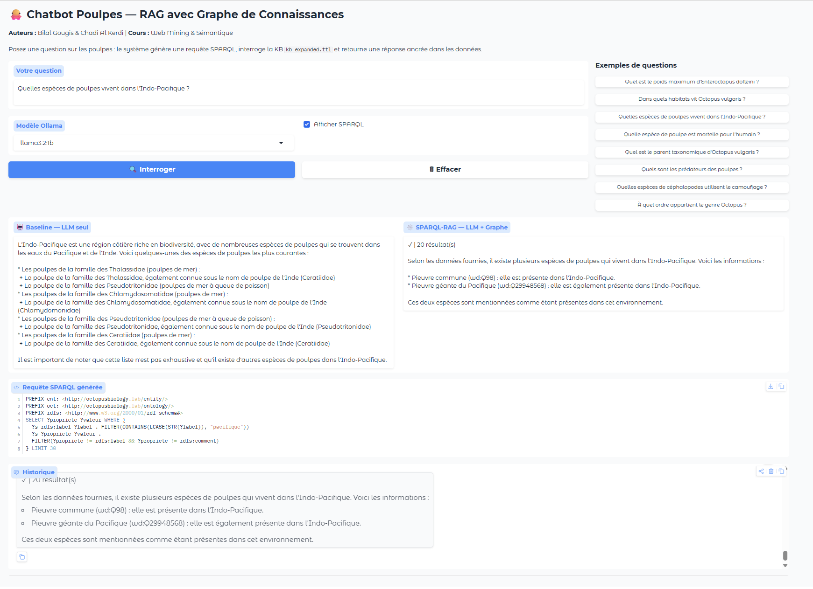

# 🐙 Projet Chatbot Poulpes — Knowledge Graph Pipeline

**Cours :** Web Mining & Sémantique  
**Auteurs :** Bilal Gougis & Chadi Al Kerdi  
**Domaine :** Biologie des Céphalopodes (Poulpes)

---

## Vue d'ensemble

Pipeline complet de construction d'un chatbot augmenté par un graphe de connaissances sur les céphalopodes :

```
Lab 1 — Crawling & NLP
    ↓  crawler_output.jsonl · extracted_knowledge.csv
Lab 2 — Construction & Expansion de la KB (RDF + Wikidata)
    ↓  kb_expanded.ttl · kb_expanded.nt
Lab 3 — Knowledge Graph Embedding (KGE)
    ↓  Modèles TransE / DistMult / ComplEx
Lab 4 — Chatbot RAG (SPARQL + LLM local)
    ↓  Interface Gradio interactive
```

## Installation

### Prérequis

- Python ≥ 3.9
- [Ollama](https://ollama.com/) installé localement
- ~8 Go d'espace disque (modèle Mistral 7B)

### Setup

```bash
# 1. Cloner le repo
git clone https://github.com/votre-repo/projet-chatbot-poulpes.git
cd projet-chatbot-poulpes

# 2. Installer les dépendances Python
pip install -r requirements.txt

# 3. Télécharger le modèle spaCy FR
python -m spacy download fr_core_news_md

# 4. Installer et lancer Ollama + modèle
ollama pull mistral
ollama serve   # laisser tourner dans un terminal séparé
```

## Comment exécuter

### Exécution séquentielle (recommandée)

Lancer les notebooks dans l'ordre depuis le dossier `notebooks/` :

```bash
# 1. Crawling & extraction NLP (~5 min)
jupyter notebook notebooks/Lab1_Crawling_NLP.ipynb

# 2. Construction & expansion KB (~30-60 min, requêtes Wikidata)
jupyter notebook notebooks/Lab2_KB_Construction_Expansion.ipynb

# 3. Knowledge Graph Embedding (~20-30 min, entraînement CPU)
jupyter notebook notebooks/Lab3_Knowledge_Graph_Embedding.ipynb

# 4. Chatbot RAG (nécessite ollama serve)
jupyter notebook notebooks/Lab4_Chatbot_RAG.ipynb
```

### Démo RAG rapide

Si vous avez déjà les fichiers KB :

```bash
# S'assurer qu'Ollama tourne
ollama serve

# Lancer directement le Lab 4
jupyter notebook notebooks/Lab4_Chatbot_RAG.ipynb
```

Le chatbot Gradio se lance automatiquement à la dernière cellule.

## Structure du projet

```
project-root/
├── src/                          # Scripts Python modulaires
│   ├── crawl/                    # Crawler web (Wikipedia, marinespecies, etc.)
│   ├── ie/                       # Extraction d'information (NER, relations)
│   ├── kg/                       # Construction du graphe RDF
│   ├── reason/                   # Raisonnement SWRL (OWLReady2)
│   ├── kge/                      # Knowledge Graph Embedding (PyKEEN)
│   └── rag/                      # Pipeline RAG (SPARQL + Ollama)
├── data/
│   └── samples/                  # Échantillons de données
├── kg_artifacts/                 # Fichiers du graphe de connaissances
│   ├── kb_initial.ttl            # KB privée initiale
│   ├── kb_expanded.ttl           # KB expansée (Turtle)
│   ├── kb_expanded.nt            # KB expansée (N-Triples)
│   ├── alignment_table.csv       # Table d'alignement entités
│   └── predicate_alignment.csv   # Table d'alignement prédicats
├── notebooks/                    # Notebooks Jupyter (4 labs)
│   ├── Lab1_Crawling_NLP.ipynb
│   ├── Lab2_KB_Construction_Expansion.ipynb
│   ├── Lab3_Knowledge_Graph_Embedding.ipynb
│   └── Lab4_Chatbot_RAG.ipynb
├── reports/
│   └── final_report.pdf          # Rapport final
├── README.md
├── requirements.txt
├── .gitignore
└── LICENSE
```

## Configuration matérielle

| Composant | Minimum | Recommandé |
|-----------|---------|------------|
| CPU | 4 cœurs | 8 cœurs |
| RAM | 8 Go | 16 Go |
| Disque | 5 Go | 10 Go |
| GPU | Non requis | Optionnel (accélère KGE) |

Tests réalisés sur : Windows 11, Intel Core, 32 Go RAM, CPU uniquement.

## Modèles utilisés

- **NLP :** spaCy `fr_core_news_md` (français)
- **KGE :** TransE, DistMult, ComplEx (via PyKEEN)
- **LLM :** Mistral 7B (via Ollama, local, aucune donnée envoyée sur internet)

## Résultats clés

### Knowledge Graph Embedding (meilleur modèle : DistMult)

| Métrique | TransE | DistMult | ComplEx |
|----------|--------|----------|---------|
| MRR | 0.19 | **0.34** | 0.00 |
| Hits@1 | 0.07 | **0.24** | 0.00 |
| Hits@3 | 0.25 | **0.38** | 0.00 |
| Hits@10 | 0.40 | **0.52** | 0.00 |

### RAG Chatbot

- 8 questions d'évaluation (baseline LLM vs SPARQL-RAG)
- Templates SPARQL pour les patterns courants (habitat, taxonomie, espèces)
- Self-repair automatique des requêtes SPARQL invalides

## Screenshot



## Licence

Ce projet est réalisé dans le cadre du cours Web Mining & Sémantique.
